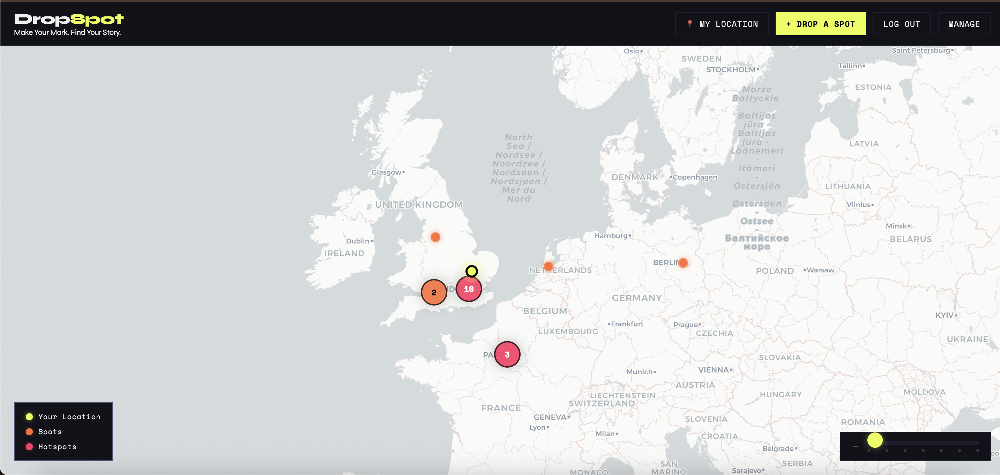
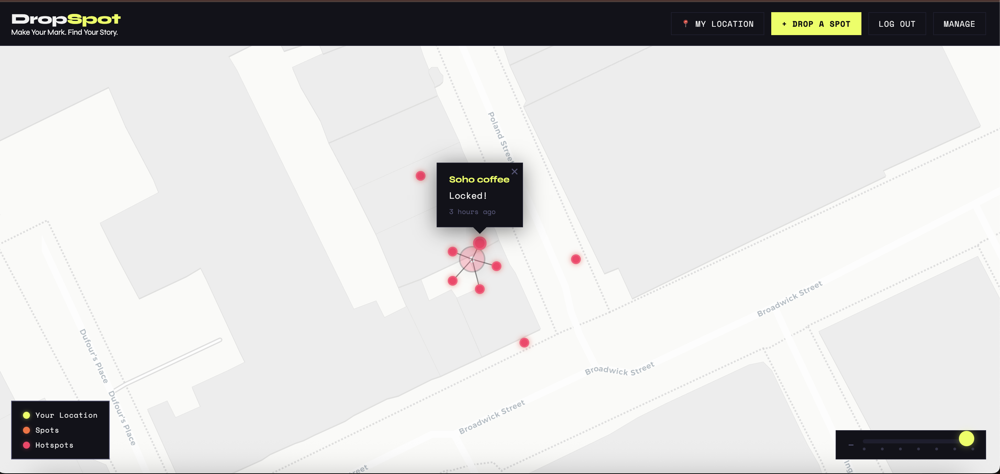
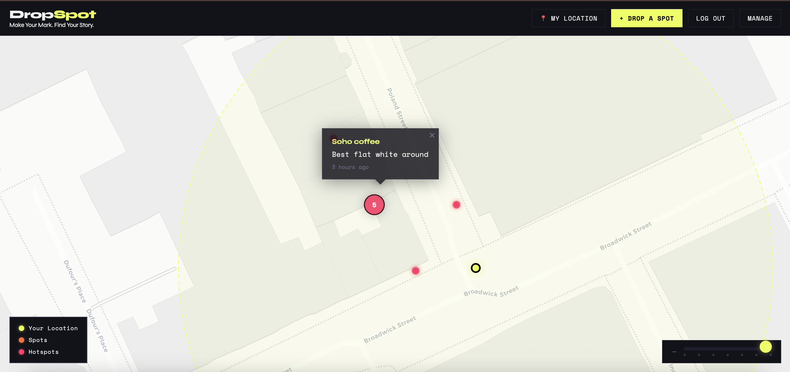
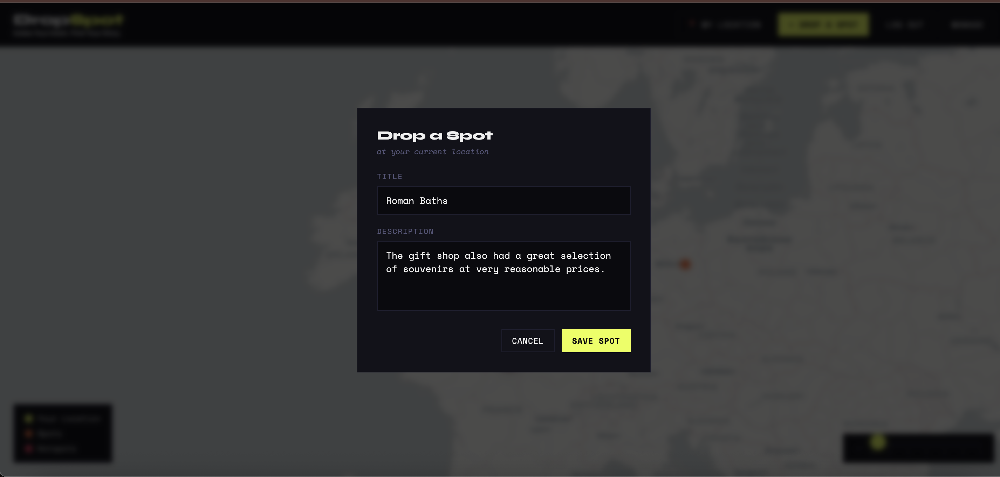

# DropSpot

DropSpot is a location-based social map where users can leave notes tied to real places, discover nearby activity, and reveal full note content only when they are physically close enough.

It combines geospatial data, real time interaction and proximity based control to create a fun unique twist on modern social media platforms.

## Features

- Create location-based notes linked to real-life geo-coordinates
- Explore notes dynamically on an interactive map 
- Read notes based on a proximity based system
- Automatic hotspot detection highlights clusters of notes as popular areas
- Manage your own notes, including editing and deleting
- Relative timestamps such as "2 hours ago"
- Shows the users radius of unlocked notes on the map

## How it Works

### Distance Based Unlocking

- The location of any notes posted by any user in the last 24hrs will be visible on the map
- The full content of the note will only be visible to users within a 50m radius
- Uses the haservine formula to determine distances between users and notes, updating in real time.

### Hotspot Detection

- Hotspots occur when there are a high number of notes within close proximity of one another
- A graph based clustering approach identifies closer areas
- Clusters above a set threshold are marked as Hotspots and are labelled differently on the map

### Map Interaction

- Uses Leaflet for rendering and marking clusters
- Dynamic map groups spots as the user zooms out


## Tech Stack

- Frontend: HTML, CSS, JavaScript, Leaflet
- Backend: Flask, Flask-CORS
- Database: MySQL

## Setup

Create a config.py file in the backend folder

```
import mysql.connector
import time

def DBconnect():
    while True:
        try:
            mydb = mysql.connector.connect(
                host="YOUR_HOST",
                user="YOUR_USER",
                password="YOUR_PASSWORD",
                port=YOUR_PORT,
                database="YOUR_DATABASE",
                ssl_ca="PATH_TO_CA_CERT"
            )
            return mydb
        except mysql.connector.Error as e:
            print("Error connecting, retrying...")
            print(f"Error: {e}")
            time.sleep(3)
```

Database setup uses the following tables

```
CREATE TABLE users (
    userID INT AUTO_INCREMENT PRIMARY KEY,
    email VARCHAR(255) NOT NULL UNIQUE,
    hashPW VARCHAR(255) NOT NULL
);

CREATE TABLE notes (
    noteID INT AUTO_INCREMENT PRIMARY KEY,
    userID INT,
    content TEXT,
    latitude DOUBLE,
    longitude DOUBLE,
    hotspot BOOLEAN DEFAULT FALSE,
    createdAt TIMESTAMP DEFAULT CURRENT_TIMESTAMP,
    FOREIGN KEY (userID) REFERENCES users(userID) ON DELETE CASCADE
);
```

## Demo

### Map with Hotspot Clustering



Notes are dynamically clustered based on geographic proximity, with popular areas identified as hotspots and highlighted using distinct colours

### Locked vs Unlocked Notes

 

Notes are locked when the user is outside the proximity, and unlock automatically when they are within range

### Dropping Spot



The user is able to drop a note only at their current location which updates for all users
